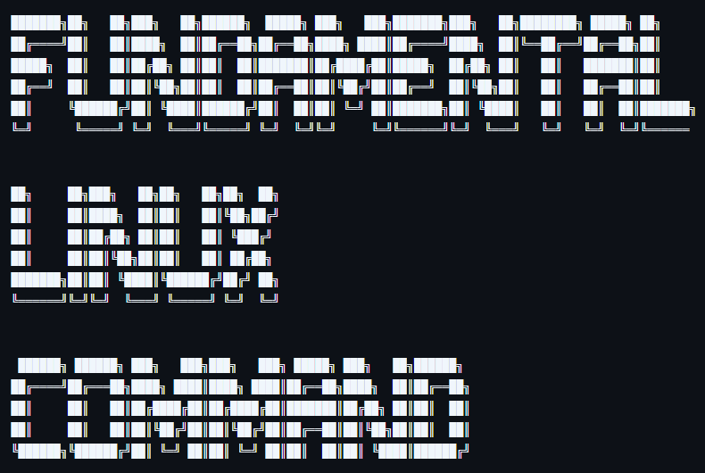

# Command CLI Linux Dasar
## Penjelasan Repository:
Ini adalah repository yang berisi command/perintah CLI Linux dasar sebagai referensi, pengingat, dan pembelajaran saya.

Released under GNU GPL v3

©2025 ArviNR, arviansyahyk@gmail.com. 

See the 

<//\\==================================================================================================//\\>

